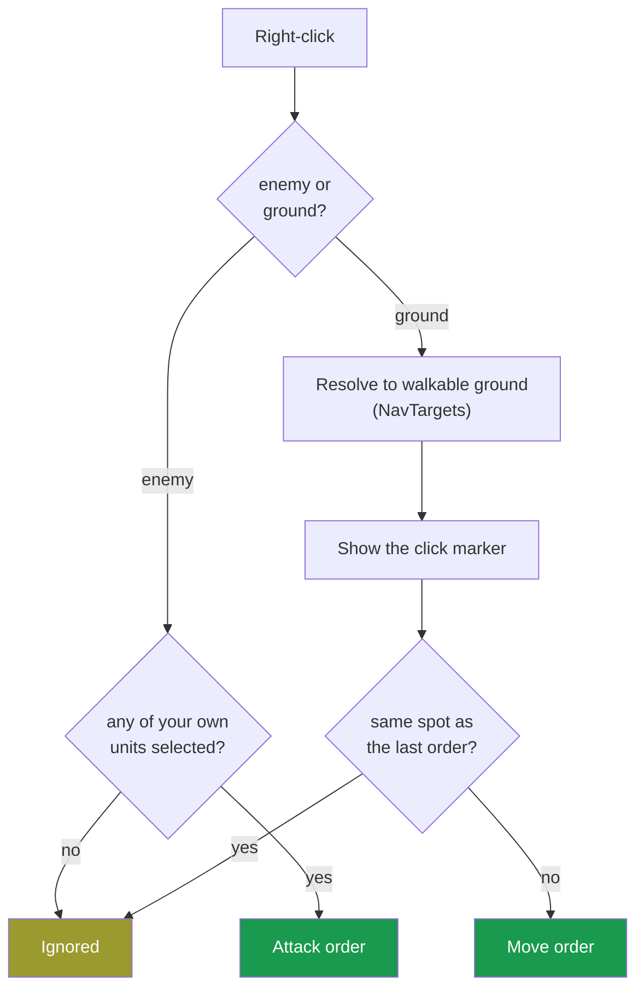
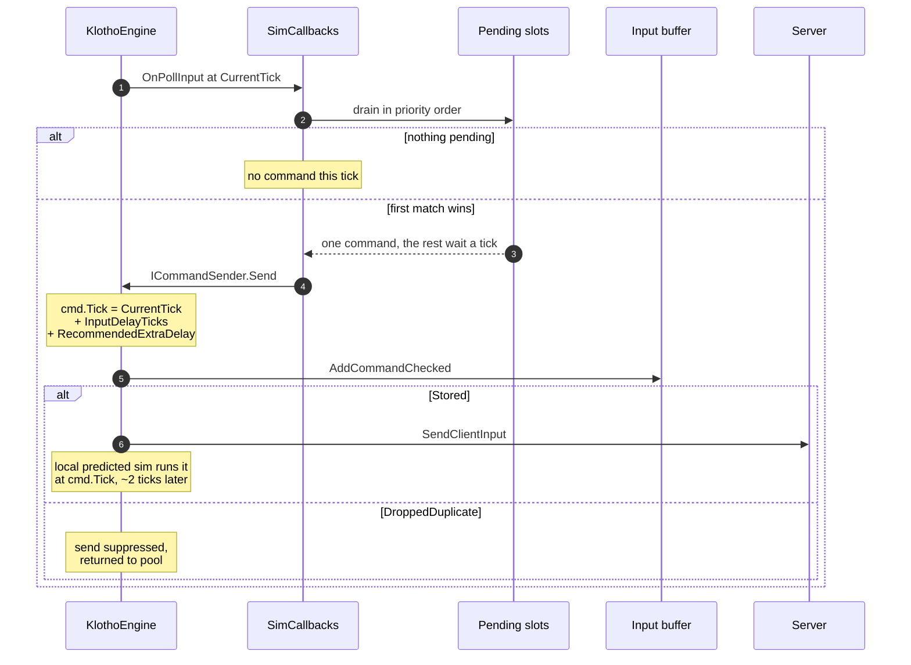
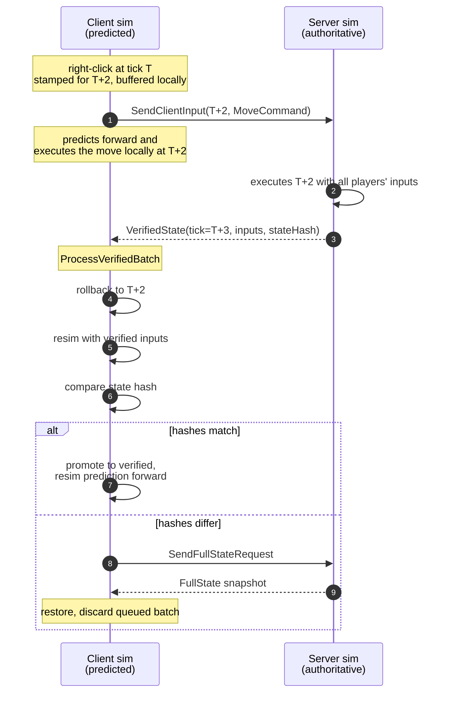
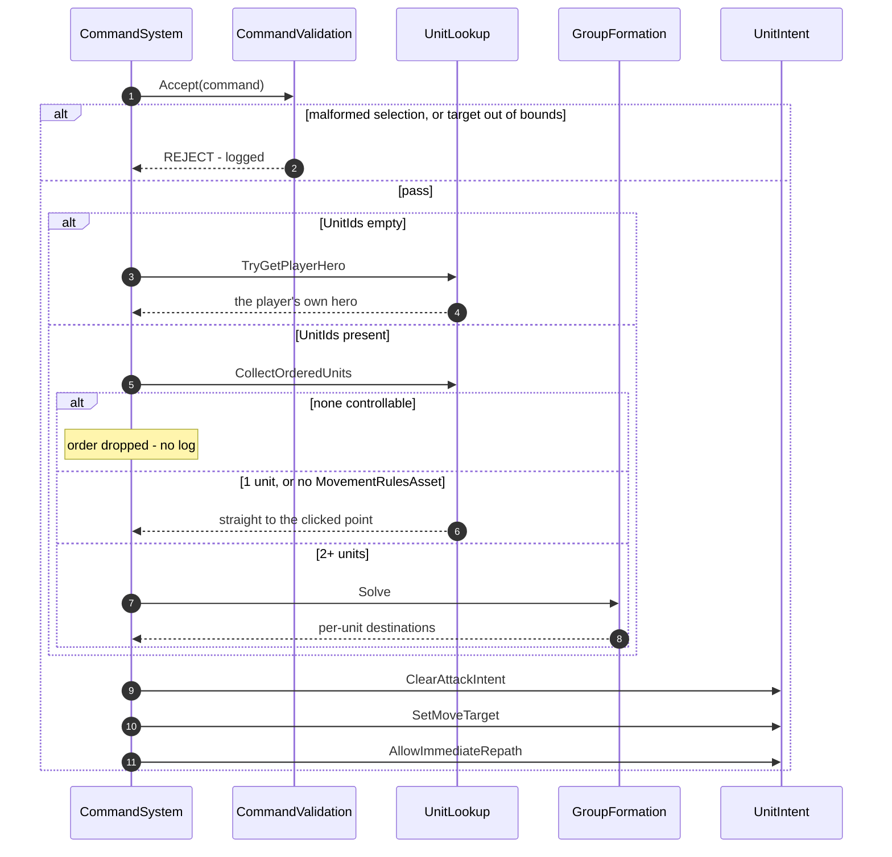
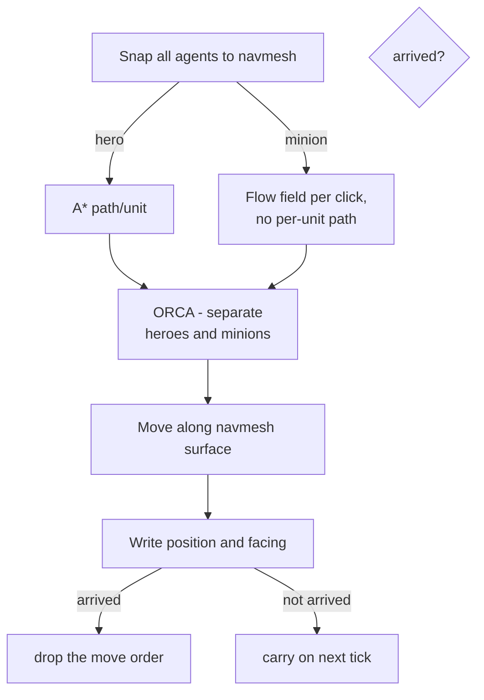

# Movement Commands and Navigation

## 1. Client - Before sending to server

- Clicking unrechable areas will move you as close as possible
- `NavTargets.ResolveMoveTarget` is the sim's own resolver, so the point sent, the point
  `CommandSystem` re-resolves, and the point the click marker draws at are the same one. It backs the
  destination `MovementRulesAsset.MoveTargetEdgeClearance` off the nearest unwalkable edge — a
  destination sitting on the boundary is one the agent grinds along instead of arriving at
- Visual feedback is shown on all clicks regardless of deduplication
- `_pendingMoveCommand` / `_pendingAttackCommand` - single slots, newest click wins

---

## 2. Client: poll, stamp, send

Klotho takes one command per player per tick, so `OnPollInput` drains a priority order and returns
after each send.

Drain order - first match returns, the rest wait a tick:

1. `SelectFaction`, once per session
2. `Purchase`
3. `Upgrade`
4. `Cast`
5. `Attack`
6. `Move`

- `cmd.Tick` - `CurrentTick + InputDelayTicks + RecommendedExtraDelay`. The tick both client and server run it on
- `InputDelayTicks` - # of ticks between the click and the command running (MP: 2, SP: 1)
- duplicate `(tick, playerId)` - dropped, not queued. Both sides keep the first, so the send is suppressed rather than allowed to diverge

The stamp applies locally too - your own predicted sim doesn't run the command on the tick you
clicked. Prediction hides the server round-trip, not your own input delay. ServerDriven refuses
`InputDelayTicks < 1`, so ~1 tick is the floor.

> **Bug:** the faction branch has no `return`. On the first poll it sends `SelectFactionCommand` and
> falls through, so anything else pending that tick collides and is lost, not retried.

---

## 3. Server round-trip and reconciliation

- `SDInputLeadTicks` - max # of ticks a client can run ahead of server (default: 2)
- `MaxRollbackTicks` - hard ceiling on that lead. Client slows approaching it, stops at it (default: 16)
- `TickIntervalMs` - ms per tick (MP: 33, SP: 25)
- hash mismatch - client requests a `FullState` snapshot and discards the queued batch

---

## 4. Sim: command to intent

- `CommandValidation` - runs inside the sim, so client prediction and the server reach the same verdict on the same frame
- `CollectOrderedUnits` - an empty result is the only rejection with no log line. An order on units you don't control vanishes silently
- `GroupFormation.Solve` - only for 2+ units. A single unit goes straight to the clicked point
- `AllowImmediateRepath` - see section 6

---

## 5. NavigationAgentSystem: the six phases

One system, every tick. Two steering strategies sharing one avoidance and one integration step.

Spatial grids - `SpatialHashGrid`, cleared and refilled every tick, queried by radius:
- `AvoidanceGridCellSize` - 5.0. Phase 4 builds **two** at this size, heroes and minions indexed separately so the two populations never avoid each other
- `TargetGridCellSize` - 10.0, the coarser one. Used by `TargetAcquisitionSystem` and `ProjectileSystem`, **not** by the nav pipeline
- `WaveSpawnSystem` builds a third at minion spacing, for spawn occupancy

Other:
- `*Spread` - stripes work across ticks. All three are `1` in `Assets/rules.json`, so every agent runs every tick
- `OffCorridorTicks` - # of ticks drifted off the corridor before forcing a repath
